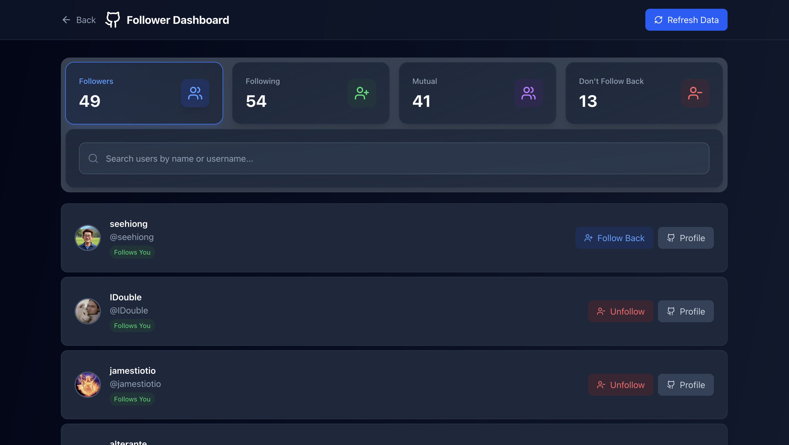

  
  <h2>GitHub Follower Manager</h2>
  
A modern web application to manage your GitHub followers and following lists. Discover mutual connections, identify one-way relationships, and clean up your GitHub network with smart insights and one-click actions. no server setup no python code, all in one place.

  <h2>Screenshots</h2>

  
  

## Features

- 👀 **Find Your True Connections**: Easily discover who actually follows you back and spot those one-sided
  relationships
- 🎯 **Get the Full Picture**: See all your follower stats at a glance - who's following, who you're following, and your
  mutual friends
- 🧑🏻‍💻 **Simple One-Click Management**: Follow, unfollow, or check out someone's profile with just a single click - no
  hassle!
- 🔒 **Your Privacy Matters**: The app never store your GitHub token anywhere - it stays safe in your browser only
- 📱 **Works Everywhere**: Whether you're on your phone, tablet, or computer, everything looks and works great
- ⚡ **Always Up-to-Date**: Get fresh data straight from GitHub in real-time, so you're never looking at old info
- 🎨 **Beautiful & Easy to Use**: Clean, modern design that's a pleasure to use and easy on the eyes

## Tech Stack

- **Frontend**: Next.js 14, React, TypeScript, Tailwind CSS
- **State Management**: TanStack Query v5, React Context API
- **API Integration**: GitHub REST API with Bearer token authentication
- **Styling**: Modern responsive design with mobile-first approach
- **Icons**: Lucide React icon library

  <h2>🚀 Visit the deployed version: <a href="https://github-follower-manager.vercel.app/">GitHub Follower Manager</a></h2>

  Made with ❤️ by <a href="https://github.com/kikoDevv">KikoDevv</a>

